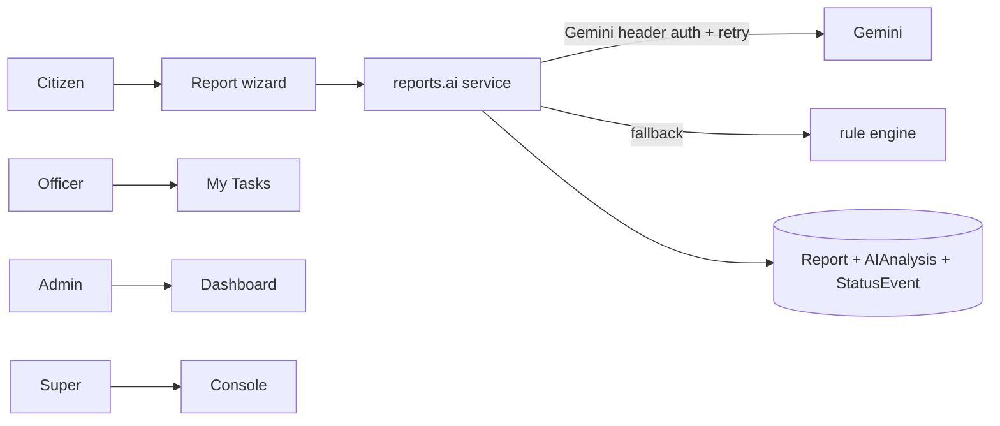

# CivicConnect AI

Civic reporting with transparent AI triage. Citizens file issues (photo + Hindi/Hinglish/English + voice), staff resolve through a full lifecycle with SLA tracking.

## Screenshots
`docs/screenshots/` — add hero, wizard, kanban, detail timeline, transparency heatmap.

## Architecture


## Roles
| Role | Scope |
|---|---|
| Citizen | own reports; confirm/reopen/rate |
| Field Officer | assigned + state/department triage; My Tasks |
| State Admin | own state; assign, SLA, bulk, CSV, internal notes, escalate |
| Super Admin | all states; leaderboard, audit, health |

## AI pipeline
`reports/ai/service.py::analyze_report_full` → Gemini (vision+text, `x-goog-api-key`, `GEMINI_MODEL`, structured JSON, 3 retries, timeout) → fallback rules. Priority Score 0–100 → Low/Medium/High/Critical with reasons. Duplicates: bbox prefilter + Haversine + token similarity. Every analysis stored in `AIAnalysis`. Invalid/missing key → instant offline fallback (keys must look like `AIza...`; anything else skips network).

## Setup
```bash
pip install -r requirements.txt
python manage.py migrate
python manage.py seed_demo_data --count 100
python manage.py runserver
```
Demo logins (password `DemoPass123!`): `demo_superadmin`, `demo_admin_up`, `demo_citizen1`.

## API
- `/api/reports/` (DRF, session auth, throttled), `/api/stats/`, OpenAPI via DRF browsable API.
- `/healthz`, `/api/assistant/`, `/api/briefing/`, `/api/ai-status/<id>/`.

## Deployment
Docker: `docker compose up --build`. Prod env: `DJANGO_DEBUG=False`, strong `DJANGO_SECRET_KEY`, `DJANGO_ALLOWED_HOSTS`, `CSRF_TRUSTED_ORIGINS`, Postgres `DATABASE_URL`. Schedule `escalate_stale_reports` hourly via cron.

## Limitations (honest)
- Google OAuth removed (was fake button).
- Escalation is a management command, not a background worker.
- Gemini Vision verified live (`gemini-2.5-flash`, 200 OK); rule-engine fallback covers missing-key/offline.
- Seed images are procedural Pillow placeholders, not real photos.
